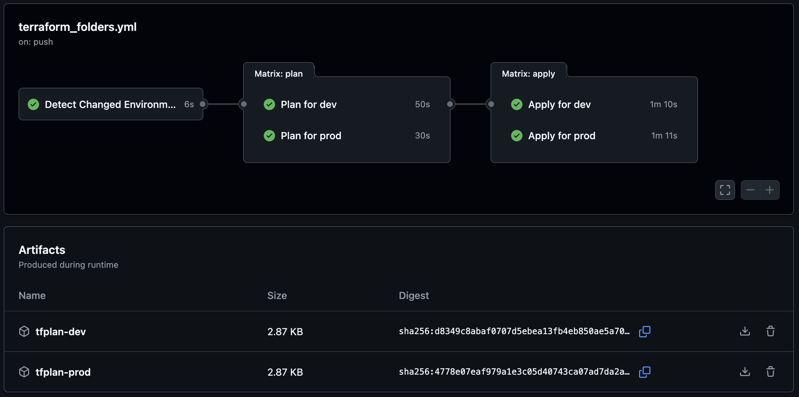
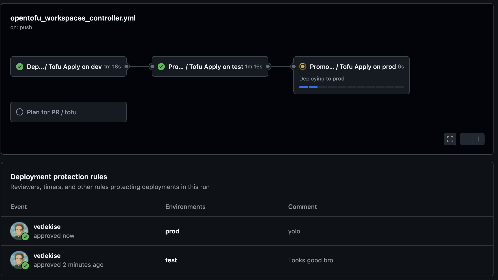
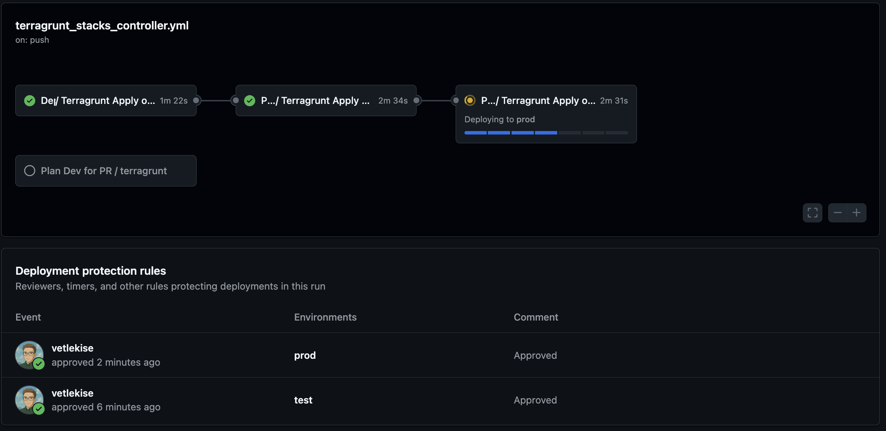

## Introduction

Every project starts simple, but when managing infrastructure for `dev`, `test`, and `prod`, let alone multiple customers, it quickly becomes complex. How can we solve this chaos?

We'll tackle the common issues of scalable IaC, and go through a clear journey from basic patterns to something more advanced, showing you how to choose the right tool for the job.

## Isolated Folders
This is the classic starting point when trying to figure out multi-environment setups. Its the simplest way to manage multiple environments by giving each one its own dedicated directory. 

### Pros
- Each environment has its own dedicated directory and state file, providing the highest level of safety and preventing accidental cross-environment changes.
- The structure is straightforward and very easy to understand, making it an excellent starting point for new projects or teams.
- The logic is intuitive, which is ideal for those new to Infrastructure as Code (IaC).

### Cons
- You must repeat boilerplate code (like providers and variables) for each environment, which violates the Don't Repeat Yourself (DRY) principle.
- As the project grows, making a change to a shared component requires updating it in every single folder, which is tedious and error-prone.
- This pattern quickly becomes unmanageable and inefficient when dealing with a large number of environments.

### Project Structure
Your repository will typically be organized into `dev`, `test`, and `prod` directories. Each environment then calls the modules from versioned repositories.

> **Note**: Instead of using separate repositories for your modules, you could create a `modules` directory. Problem with this is versioning and its difficult for others to reuse your module.

```
application/
├── dev/
│   ├── main.tf           # Calls the versioned 'core-infra'
│   ├── variables.tf      # Declares variables for the dev environment
│   └── terraform.tfvars  # Assigns values for dev
│
└── prod/
    ├── main.tf
    ├── variables.tf
    └── terraform.tfvars
```

### Configuration Examples
Let's say you have another repository acting as a Terraform module called `core-infra` and you want this deployed to the `dev` environment. This module has its own `variables.tf` with variable declarations (aka. input parameters). You then declare the required variables in your application repo `dev/variables.tf`:

```terraform
variable "vm_count" {
  description = "Number of Azure Virtual Machines."
  type        = number
}

variable "vm_size" {
  description = "The Azure VM size."
  type        = string
}

variable "location" {
  description = "The Azure region where resources will be deployed."
  type        = string
}
```

This is where the duplicate code comes in. You've now declared variables in `dev/variables.tf`, but now you want to deploy the same module to the `prod` environment, so now you have to duplicate the variables in `prod/variables.tf`

To provide values to the variables you add the following to `dev/terraform.tfvars`:

```terraform
vm_count = 1
vm_size  = "Standard_B1s"
location = "Norway East"
```

In `dev/main.tf` is where you would call your reusable module `core-infra`.

```terraform
module "core_infra" {
  # Source points to a separate Git repo and a specific version tag
  source = "git@github.com:your-org/core-infra.git?ref=v1.0.0"

  # Pass values to the module
  environment = "dev"
  vm_count    = var.vm_count
  vm_size     = var.vm_size
  location    = var.location
}
```

Why not hardcode all the values in the module call you ask? 

A `.tfvars` file acts as a clean, simple *input sheet* for an environment. Someone less familiar with Terraform would immediately see all the key parameters instead of needing to look in the configuration files. You can also easily override them using `terraform apply -var="location=westeurope"` which makes automation easier.

### Local Workflow
To deploy the `dev` environment, navigate into its folder within the `application` repo and apply the configuration:
```bash
# 1. Clone the live application repo and change into it
git clone git@github.com:your-org/application.git
cd application/dev

# 2. Initialize Terraform (this will download the module from Git)
terraform init

# 3. Plan and Apply
terraform plan
terraform apply
```

### CI/CD Pipeline (GitHub Actions)
The following workflow example is dynamic. It looks at the changed environments and builds a matrix to dynamically run plan and apply to the correct environment.
```yaml
name: 'Terraform Folders'

on:
  pull_request:
    types: [opened, synchronize, reopened]
    branches: [main]
    paths:
      - 'dev/**'
      - 'prod/**'
  push:
    branches: [main]
    paths:
      - 'dev/**'
      - 'prod/**'

# Add permissions for writing PR comments.
# You may need to add more permissions here for your cloud provider's OIDC.
permissions:
  pull-requests: write
  # Example for OIDC:
  # id-token: write
  # contents: read

jobs:
  detect-changes:
    name: 'Detect Changed Environments'
    runs-on: ubuntu-latest
    outputs:
      environments: ${{ steps.filter.outputs.all_changed_files }}
    steps:
      - name: 'Checkout Code'
        uses: actions/checkout@v5
        with:
          fetch-depth: 0

      - name: 'Find changed environment folders'
        id: filter
        uses: tj-actions/changed-files@v44
        with:
          # Since dev/prod are in root, the base path is the repository root
          path: '.'
          dir_names: "true"
          json: true
          escape_json: false
          # Define the environment folders to watch for changes
          files: |
            dev/**
            prod/**

      - name: 'Debug Output'
        run: |
            echo "Detected changes: ${{ steps.filter.outputs.all_changed_files }}"

  plan:
    name: 'Plan for ${{ matrix.environment }}'
    runs-on: ubuntu-latest
    needs: detect-changes
    if: needs.detect-changes.outputs.environments != '[]'

    strategy:
      matrix:
        environment: ${{ fromJson(needs.detect-changes.outputs.environments) }}

    steps:
      - name: 'Checkout Code'
        uses: actions/checkout@v5

      - name: 'Setup Terraform'
        uses: hashicorp/setup-terraform@v3
    
      # Add your cloud provider login step here.

      - name: 'Terraform Init'
        id: init
        working-directory: ${{ matrix.environment }}
        run: terraform init -no-color
      
      - name: 'Terraform Plan'
        id: plan
        working-directory: ${{ matrix.environment }}
        run: terraform plan -no-color -out=tfplan

      - name: 'Upload Plan Artifact'
        uses: actions/upload-artifact@v4
        with:
          name: tfplan-${{ matrix.environment }}
          path: ${{ matrix.environment }}/tfplan

      - name: Post Plan Comment to PR
        if: steps.plan.outcome == 'success' && github.event_name == 'pull_request'
        uses: actions/github-script@v8
        env:
          PLAN: "${{ steps.plan.outputs.stdout }}"
        with:
          script: |
            const { PLAN } = process.env;
            
            const output = `#### Terraform Plan for \`${{ matrix.environment }}\`
            <details><summary>Show Plan</summary>
            
            \`\`\`terraform
            ${PLAN}
            \`\`\`
            
            </details>
            
            *Pushed by: @${{ github.actor }}, Action: \`${{ github.event_name }}\`*`;
            
            await github.rest.issues.createComment({
              owner: context.repo.owner,
              repo: context.repo.repo,
              issue_number: context.issue.number,
              body: output
            });

  apply:
    name: 'Apply for ${{ matrix.environment }}'
    runs-on: ubuntu-latest
    needs: [detect-changes, plan]
    if: github.event_name == 'push' && github.ref == 'refs/heads/main' && needs.detect-changes.outputs.environments != '[]'

    strategy:
      matrix:
        environment: ${{ fromJson(needs.detect-changes.outputs.environments) }}

    steps:
      - name: 'Checkout Code'
        uses: actions/checkout@v5

      - name: 'Setup Terraform'
        uses: hashicorp/setup-terraform@v3

      # Add your cloud provider login step here (same as in the plan job).

      - name: 'Download Plan Artifact'
        uses: actions/download-artifact@v5
        with:
          name: tfplan-${{ matrix.environment }}
          path: ${{ matrix.environment }}

      - name: 'Terraform Init'
        id: init
        working-directory: ${{ matrix.environment }}
        run: terraform init -no-color

      - name: 'Terraform Apply'
        id: apply
        working-directory: ${{ matrix.environment }}
        run: terraform apply -auto-approve "tfplan"
```




## OpenTofu Workspaces
Terraform has a feature called [Workspaces](https://developer.hashicorp.com/terraform/language/state/workspaces) that's used to deploy the same code to multiple environments, keeping your configuration DRY. It still uses one backend but creates separate states for better isolation.

While Terraform workspaces *work*, we are going to leverage an exclusive OpenTofu feature `early variable evaluation` to make our lives easier.

**FAILS** in Terraform:
```terraform
# You cannot enable or disable a module based on the workspace.
module "monitoring_alerts" {
  source = "./modules/monitoring"

  count  = terraform.workspace == "prod" ? 1 : 0 # ERROR
}
```

**WORKS** in OpenTofu:
```terraform
# You can enable or disable a modules based on the workspace.
module "monitoring_alerts" {
  source = "./modules/monitoring"

  count  = tofu.workspace == "prod" ? 1 : 0
}
```

### Pros
- It keeps your codebase clean by using a single set of configuration files for all environments, eliminating boilerplate code.
- Workspaces provide a safe way to manage separate state files for each environment while using the same backend configuration.
- You can efficiently manage a single application or service across multiple similar environments from one place.

### Cons
- As environments diverge, the code can become cluttered with complex conditional logic (`count`, `for_each`), making it hard to read and maintain.
- A mistake in the single codebase can potentially affect all environments, as they are not fully isolated at the code level.
- The pattern is less suitable for managing vastly different environments, as forcing all variations into one set of files leads to overly complicated configurations.

### Project Structure
With workspaces, your directory structure becomes quite simple. All your config for the application lives in a single folder:
```
application/
├── main.tf              # The main logic.
├── variables.tf         # A SINGLE declaration of all variables
├── dev.tfvars           # Values for the 'dev' environment
├── prod.tfvars          # Values for the 'prod' environment
└── backend.tf           # Defines the remote state backend
```

> **Note**: Example above only uses a main.tf file, but there's nothing stopping you from creating more configurations!

### Configuration Examples
`variables.tf`

Variables are declared only once.
```terraform
variable "vm_count" {
  description = "The number of Azure Virtual Machines."
  type        = number
}

variable "vm_size" {
  description = "The Azure VM size (e.g., 'Standard_B1s')."
  type        = string
}

variable "location" {
  description = "The Azure region where resources will be deployed."
  type        = string
}
```

`<insert_env>.tfvars`

Provides specific values for each environment.
```terraform
vm_count = 1
vm_size = "Standard_B1s"
location = "Norway East"
```

`main.tf`

Handle resource creation with conditionals.
```terraform
# This main module is enabled for all workspaces
module "core_infra" {
  source = "git@github.com:your-org/core-infra.git?ref=v1.0.0"

  vm_count    = var.vm_count
  vm_size     = var.vm_size
  location    = var.location
  environment = tofu.workspace # The workspace name is used to tag resources
}

# The monitoring module is conditionally enabled only in the 'prod' environment
module "monitoring_alerts" {
  source = "git@github.com:your-org/monitoring-alerts.git?ref=v1.2.0"
  
  # This works perfectly in OpenTofu, allowing dynamic environments
  count  = tofu.workspace == "prod" ? 1 : 0
}
```

### Local Workflow
The workflow involves selecting the correct workspace context before applying.
```bash
# 1. Clone the application repo and change into it
git clone git@github.com:your-org/application.git
cd application

# 2. Initialize OpenTofu (this will download the module from Git)
tofu init

# 3. Create workspaces
tofu workspace new dev
tofu workspace new prod

# 4. Deploy to 'dev'
# 4.1 Switch to the 'dev' workspace
tofu workspace select dev

# 4.2 Plan and apply, specifying the correct .tfvars file
tofu plan -var-file="dev.tfvars"
tofu apply -var-file="dev.tfvars"
```

### CI/CD Pipeline (GitHub Actions)
This pipeline uses a GitHub Actions feature called **reusable workflows** to keep your pipeline DRY and easy to manage. The logic is split into two files: a reusable **worker** that performs the deployment, and a main **orchestrator** that defines the release process.

`reusable-worker.yml`

Contains all the steps to deploy to any single environment. It accepts an `environment` name as an input, which it uses to dynamically select the correct OpenTofu workspace and `tfvars` file. This means you only have to define your deployment logic once.

```yaml
name: 'Tofu Reusable Worker'

on:
  workflow_call:
    inputs:
      environment:
        required: true
        type: string
      plan_only:
        required: false
        type: boolean
        default: false

permissions:
  id-token: write
  contents: read
  pull-requests: write

jobs:
  tofu:
    name: "Tofu ${{ inputs.plan_only && 'Plan' || 'Apply' }} on ${{ inputs.environment }}"
    runs-on: ubuntu-latest
    environment: ${{ inputs.environment }}

    steps:
      - name: 'Checkout Code'
        uses: actions/checkout@v4

      - name: 'Setup OpenTofu'
        uses: opentofu/setup-opentofu@v1

      # Add your cloud provider login here.

      - name: 'Tofu Init'
        run: tofu init

      - name: 'Select or Create Workspace'
        run: tofu workspace select -or-create ${{ inputs.environment }}

      - name: 'Tofu Validate'
        run: tofu validate -no-color

      - name: 'Tofu Plan'
        id: plan
        run: tofu plan -var-file="${{ inputs.environment }}.tfvars" -no-color -out=tfplan
        continue-on-error: ${{ inputs.plan_only }}

      - name: 'Post Plan Comment to PR'
        if: inputs.plan_only && github.event_name == 'pull_request'
        uses: actions/github-script@v7
        env:
          PLAN: "tofu\n${{ steps.plan.outputs.stdout }}"
        with:
          script: |
            const { PLAN } = process.env;
            const output = `#### OpenTofu Plan 📖 \`${{ github.event.pull_request.head.sha }}\` for \`${{ inputs.environment }}\`
            <details><summary>Show Plan</summary>

            \`\`\`\n${PLAN}\n\`\`\`

            </details>

            *Pushed by: @${{ github.actor }}, Action: \`${{ github.event_name }}\`*`;

            await github.rest.issues.createComment({
              owner: context.repo.owner,
              repo: context.repo.repo,
              issue_number: context.issue.number,
              body: output
            });

            if ("${{ steps.plan.outcome }}" == "failure") {
              process.exit(1);
            }

      - name: 'Tofu Apply'
        if: inputs.plan_only == false && steps.plan.outcome == 'success'
        run: tofu apply -auto-approve "tfplan"
```

`deploy-orchestrator.yml`

The main pipeline orchestrates the release by calling the reusable workflow for each stage. The `needs:` keyword creates a promotion chain, ensuring `dev` deploys first, followed by `test`, and finally `prod`. Each job simply passes the correct `environment` name to the reusable workflow.

```yaml
name: 'Tofu Deploy Orchestrator'

on:
  push:
    branches:
      - main
  pull_request:
    branches:
      - main

permissions:
  id-token: write
  contents: read
  pull-requests: write

jobs:
  plan:
    name: 'Plan for PR'
    if: github.event_name == 'pull_request'
    uses: ./.github/workflows/opentofu_workspaces_reusable.yml
    with:
      environment: dev
      plan_only: true

  deploy-dev:
    name: 'Deploy to DEV'
    if: github.event_name == 'push'
    uses: ./.github/workflows/opentofu_workspaces_reusable.yml
    with:
      environment: dev

  deploy-test:
    name: 'Promote to TEST'
    if: github.event_name == 'push'
    needs: deploy-dev
    uses: ./.github/workflows/opentofu_workspaces_reusable.yml
    with:
      environment: test

  deploy-prod:
    name: 'Promote to PROD'
    if: github.event_name == 'push'
    needs: deploy-test
    uses: ./.github/workflows/opentofu_workspaces_reusable.yml
    with:
      environment: prod
```



## Terragrunt Explicit Stacks
As your application grows, its infrastructure often evolves from a single component into a **stack** of several services. Managing the deployment order and dependencies of a complex stack with plain OpenTofu/Terraform can become difficult.

This is where Terragrunt, a thin wrapper for OpenTofu and Terraform, becomes essential. It excels at managing multi-component applications and keeping your configurations DRY. Specifically, the modern **Explicit Stack** pattern provides a powerful "blueprint" model to define and generate your entire infrastructure.

### Pros
- Define an entire stack once in a `terragrunt.stack.hcl` blueprint, then easily create copies for `dev`, `test`, and `prod`.
- See the complete composition of an environment in a single, clear blueprint file.
- Terragrunt builds a deployment graph from your blueprint, automatically ensuring the correct deployment order.
- Plan or apply an entire environment with a single command, like `terragrunt stack run apply`.

### Cons
- Requires learning the advanced blueprint concepts of `unit` blocks, `values`, and the generation process.
- Auto-generated files in the `.terragrunt-stack` directory can make debugging feel less direct than with simpler models.
- The required structure (`units`, `stacks`) can be overkill for smaller projects.

### Project Structure
Terragrunt separates your live infrastructure configuration from your reusable modules. Your Terraform modules live in their own versioned Git repositories, while your live infrastructure repository contains the units (`wrappers`) and stacks (`blueprints`).
```
application/
├── root.hcl              # Root config (backend, common variables)
│
├── units/
│   ├── resource_group/
│   │   └── terragrunt.hcl   # Reusable wrapper for a resource_group module
│   └── storage_account/
│       └── terragrunt.hcl   # Reusable wrapper for a storage_account module
│
└── stacks/
    └── dev/
    │   └── terragrunt.stack.hcl # THE BLUEPRINT for the 'dev' environment
    └── prod/
        └── terragrunt.stack.hcl # THE BLUEPRINT for the 'prod' environment
```

### Configuration Examples

`root.hcl`

This file, at the top of your repository, defines configurations that are inherited by all other modules, eliminating repetition.

```terraform
# Configure the remote state backend ONCE for all modules.
remote_state {
  backend = "azurerm"
  generate = {
    path      = "backend.tf"
    if_exists = "overwrite_terragrunt"
  }
  config = {
    use_azuread_auth     = true
    use_oidc             = true
    resource_group_name  = ""
    storage_account_name = ""
    container_name       = ""
    key                  = "${path_relative_to_include()}/terraform.tfstate" # e.g. dev/vnet/terraform.tfstate
  }
}

# Generate an Azure provider block for every module
generate "provider" {
  path      = "provider.tf"
  if_exists = "overwrite_terragrunt"
  contents  = <<EOF
provider "azurerm" {
  features {}
}
EOF
}

# Define common inputs for all modules in this repo
inputs = {
  location    = "norwayeast"
}
```

`units/resource_group/terragrunt.hcl`

This is a reusable "unit template" that wraps your Terraform module. The `values` object is used to access variables passed down from the blueprint.

```terraform
include "root" {
  path = find_in_parent_folders("root.hcl")
}

terraform {
  # The source URL is in from the blueprint
  source = values.module_source
}

# The inputs are also passed in from the blueprint's 'values'
inputs = {
  name        = values.name
  environment = values.environment
}
```

`units/storage_account/terragrunt.hcl`

This unit template shows how to define a dependency. The config_path uses a variable that will be provided by the blueprint.

```terraform
include "root" {
  path = find_in_parent_folders("root.hcl")
}

terraform {
  # The source URL is passed in from the blueprint
  source = values.module_source
}

dependency "resource_group" {
  # The path to the dependency is passed in from the blueprint
  config_path  = values.resource_group_path

  mock_outputs = {
    # The mock value is passed in from the blueprint
    rg_name = values.mock_rg_name
  }
}

inputs = {
  name        = values.name
  environment = values.environment
  rg_name     = dependency.resource_group.outputs.rg_name
}
```

`stacks/dev/terragrunt.stack.hcl`

This is the blueprint. It assembles the final environment by pointing to the reusable units and providing the specific values for `dev`.

```terraform
unit "resource_group" {
  # Source points to our reusable Unit Template
  source = "../../units/resource_group"
  path   = "resource_group"

  # These 'values' are passed as variables to the unit's terragrunt.hcl
  values = {
    # This points to your versioned Terraform module repository
    module_source = "git::git@github.com:your-org/terraform-azurerm-resource-group.git?ref=v1.0.0"

    # Module-specific inputs
    name        = "grunt-dev"
    environment = "dev"
  }
}

unit "storage_account" {
  source = "../../units/storage_account"
  path   = "storage_account"

  values = {
    # This points to your versioned Terraform module repository
    module_source = "git::git@github.com:your-org/terraform-azurerm-storage-account.git?ref=v1.2.0"

    # Module-specific inputs
    name        = "gruntdev932847"
    environment = "dev"

    # We pass the relative path that the dependency
    # block in the unit template needs to find the other generated unit.
    resource_group_path = "../resource_group"

    # We also pass the mock value to keep the unit template generic.
    mock_rg_name = "grunt-dev"
  }
}
```

### Local Workflow
To deploy the entire `dev` stack, you run a `stack` command from the directory containing the blueprint.

```bash
# Clone repository
git clone git@github.com:your-org/application.git
# Navigate to the blueprint's folder
cd stacks/dev

# This single command generates, plans, and applies the entire stack in the correct order.
terragrunt stack run plan
terragrunt stack run apply
```

### CI/CD Pipeline (GitHub Actions)
Similar to how we did the OpenTofu pipeline, this uses a reusable workflow to create a promotion path from `dev` to `prod`. The entire process is driven by the stack blueprints.

`reusable-worker.yml`

This workflow performs the `plan` or `apply` for a single environment. It's cloud-agnostic and runs from the repository root.

```yaml
name: 'Terragrunt Reusable Worker'
on:
  workflow_call:
    inputs:
      environment:
        required: true
        type: string # e.g., "dev", "prod"
      plan_only:
        required: false
        type: boolean
        default: false
permissions:
  id-token: write # For cloud OIDC login
  contents: read

jobs:
  terragrunt:
    name: "Terragrunt ${{ inputs.plan_only && 'Plan' || 'Apply' }} on ${{ inputs.environment }}"
    runs-on: ubuntu-latest
    environment: ${{ inputs.environment }}

    steps:
      - name: 'Checkout Code'
        uses: actions/checkout@v4

      - name: 'Setup OpenTofu & Terragrunt'
        uses: gruntwork-io/terragrunt-action@v3
        with:
          tg_version: 'v0.90.0'
          tofu_version: '1.10.6'

        # Add your cloud provider login

      - name: 'Terragrunt Plan'
        if: inputs.plan_only
        working-directory: stacks/${{ inputs.environment }}
        run: terragrunt stack run plan

      - name: 'Terragrunt Apply'
        if: inputs.plan_only == false
        working-directory: stacks/${{ inputs.environment }}
        run: terragrunt stack run apply --non-interactive
```

`deploy-orchestrator.yml`

This main pipeline orchestrates the release process by calling the reusable worker for each environment.

```yaml
name: 'Terragrunt Deploy Orchestrator'
on:
  push:
    branches: [main]
  pull_request:
    branches: [main]
    paths:
      - '**.hcl'
      - '.github/workflows/**'

jobs:
  plan-dev:
    name: 'Plan Dev for PR'
    if: github.event_name == 'pull_request'
    uses: ./.github/workflows/reusable-worker.yml
    with:
      environment: dev
      plan_only: true
    secrets: inherit

  deploy-dev:
    name: 'Deploy to DEV'
    if: github.ref == 'refs/heads/main' && github.event_name == 'push'
    uses: ./.github/workflows/reusable-worker.yml
    with:
      environment: dev
    secrets: inherit

  deploy-prod:
    name: 'Promote to PROD'
    if: github.ref == 'refs/heads/main' && github.event_name == 'push'
    needs: deploy-dev
    uses: ./.github/workflows/reusable-worker.yml
    with:
      environment: prod
    secrets: inherit
```



## Conclusion
There is no single **best** solution, only the right one for your project's current scale and complexity.

| Feature | Isolated Folders | OpenTofu Workspaces | Terragrunt Explicit Stacks |
| :--: | :--: | :--: | :--: |
| Simple to Start | ✅ | ✅ | 🟡 |
| DRY (No Repetition) | ❌ | ✅ | ✅ |
| Strong Code Isolation | ✅ | 🟡 | ✅ |
| Dependency Management | ❌ | ❌ | ✅ |
| Advanced Blueprints | ❌ | ❌ | ✅ |
| Scales for Complex Stacks | ❌ | 🟡 | ✅ |

> **Note**: The GitHub Actions workflows in this article are robust foundations. I encourage you to adapt the triggers, promotion rules, and cloud provider steps to fit your team's specific needs and policies.

## Resources & Links
For more detailed information on stuff used in this article, please refer to the official documentation.
- [OpenTofu Workspaces](https://opentofu.org/docs/language/state/workspaces/)
- [Terragrunt Explicit Stacks](https://terragrunt.gruntwork.io/docs/features/stacks/)
    - [Configuration Examples](https://github.com/gruntwork-io/terragrunt-infrastructure-catalog-example/tree/main/examples/terragrunt/stacks)
- [GitHub Actions](https://docs.github.com/en/actions)