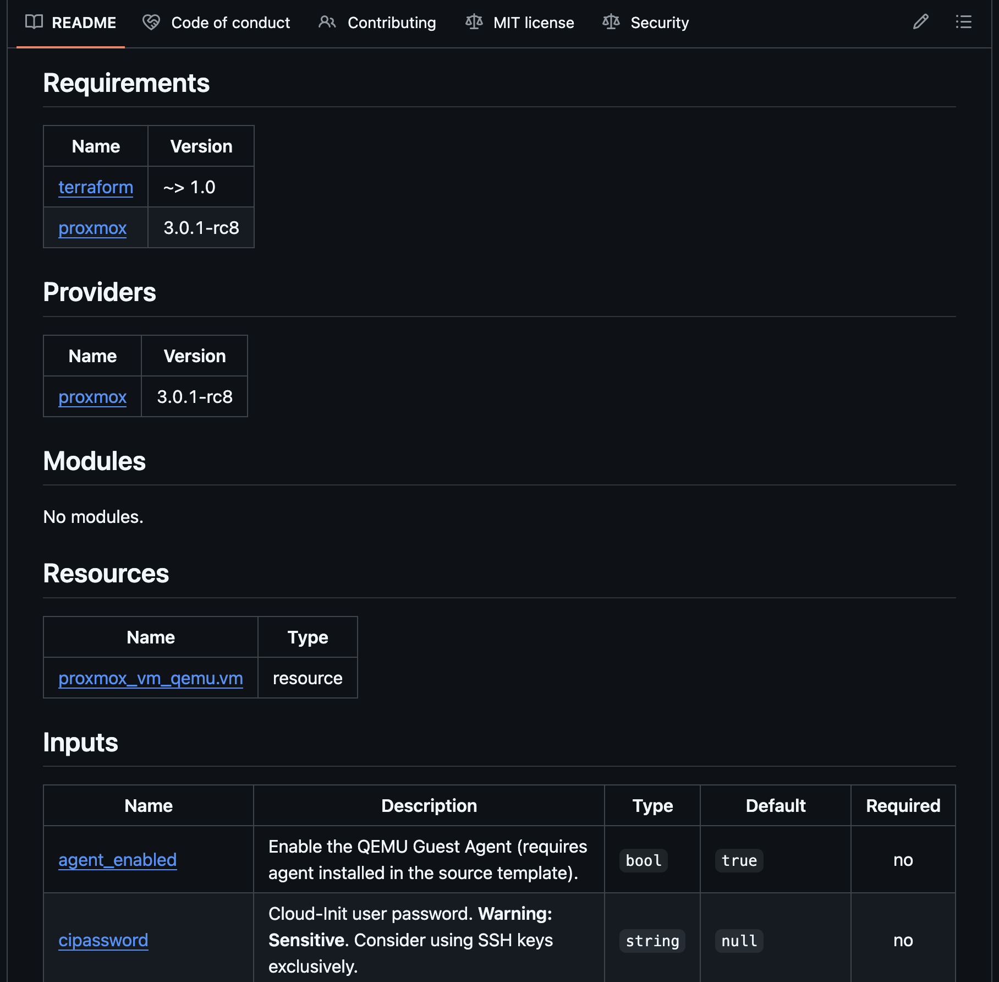
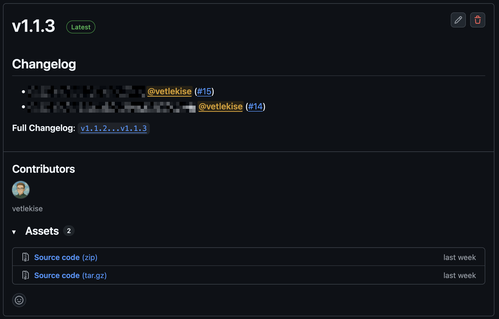

## Monorepo vs Multi-repo
A **Terraform Monorepo** (or **Terralith**), keeps all of your Terraform modules in a single Git repository, often in a `modules` directory. While simple at first, this pattern makes it difficult for other teams to reuse your modules and complicates versioning. It's generally considered an anti-pattern unless the modules are highly specific to a single application.

Instead, you should almost always use the **multi-repo** pattern. Each module lives in its own dedicated Git repository. This approach makes your module a standalone component that is easy to share, maintain, and version. Consumers of your module can then reference a specific version using a Git tag.

```terraform
module "example" {
  source = "github.com/organization/repository?ref=v1.0.0"

  # Use commit hash to prevent supply chain attacks.
  # source = "github.com/organization/repository-name?ref=a1b2c3d4e5f6g7h8i9j0k1l2m3n4o5p6q7r8s9t0"
}
```

## Writing
A well-written module is like a function, it accepts inputs, performs an action and returns outputs.

- **Variables as an API**
    - Treat your `variables` as the public API of your module. Every variable should have a clear description, type, and a default value if possible. This make it easier to use and understand.
- **Focused outputs**
    - Use `outputs` to expose important resource attributes that consumers of the module *might* need.
- **Keep it simple**
    - A good module does one thing well. For example, create one module for networking and another for a database. This makes your modules more flexible.

Example project structure:
```
├── README.md # Documentation and quick usage
├── main.tf # General configuration
├── variables.tf
├── outputs.tf
├── versions.tf # Required providers
└── examples/ # More module usage examples
    └── advanced/
        ├── main.tf
        └── outputs.tf
```

## Documentation
Good documentation is important for making your modules usable. Manually writing it tho, is boring as heck. Instead, you should automatically generate it from your code using a tool like [terraform-docs](https://github.com/terraform-docs/terraform-docs).

It scans your `.tf` files and updates your `README.md` file with required versions, descriptions, types, and default values for all of your variables and outputs.

To use it, run the following command in your module's root directory:
```bash
# This command generates a markdown table and updates your README.
terraform-docs markdown table --output-file README.md .
```

You should ideally run this in a [pre-commit](https://github.com/pre-commit/pre-commit) hook or a CI/CD pipeline to ensure your documentation is always up-to-date with your code.



## Versioning
Versioning allows users to consume your module without worrying about unexpected breaking changes. The standard practice is to use [Semantic Versioning (SemVer)](https://semver.org/), which follows a `MAJOR.MINOR.PATCH` format.
- **MAJOR** (`1.0.0` > `2.0.0`): For incompatible or breaking changes.
- **MINOR** (`1.0.0` > `1.1.0`): For adding new features in a backward-compatible way.
- **PATCH** (`1.0.0` > `1.0.1`): For backward-compatible bug fixes.

To release a new version in Git, you simply create and push a new Git tag.
```bash
# Create a new tag for your first major release
git tag v1.0.0

# Push the tag to your remote repository
git push origin v1.0.0
```

This process can also be automated with a tool like [release-drafter](https://github.com/release-drafter/release-drafter). This can be easily implemented in a GitHub Actions pipeline. It builds a release draft with a changelog based on labels in pull requests. You configure everything in a `.github/release-drafter.yml` file.



## Using a Repository Template
To save you the trouble of creating a module template yourself, I've created my own template you're free to use - [vetlekise/terraform-module-template](https://github.com/vetlekise/terraform-module-template)

This template includes pre-commit hooks for linting, compliance scanning, and vulnerability scanning. This catches most issues before they're even pushed. 

It also includes a CI/CD pipeline using GitHub Actions for linting, documentation, and releases. This catches stuff that gets past the pre-commit hooks. It also automatically builds your documentation, and automatically creates a release draft with a changelog based on labels in pull requests.

## Conclusion
By following these practices, you can create Terraform modules that are robust, reusable, and easy to maintain. Here's a short summary of the most important points:
- Use multi-repo project structure if you want the module to be easily maintainable and accessible to others.
- Look at variables as input parameters for the user.
- Version your modules using Semantic Versioning (X.Y.Z)
- Automate your documentation and versioning

## Resources & Links
- [pre-commit](https://github.com/pre-commit/pre-commit)
    - [terraform hooks](https://github.com/antonbabenko/pre-commit-terraform)
- [terraform-docs](https://github.com/terraform-docs/terraform-docs)
- [release-drafter](https://github.com/release-drafter/release-drafter)