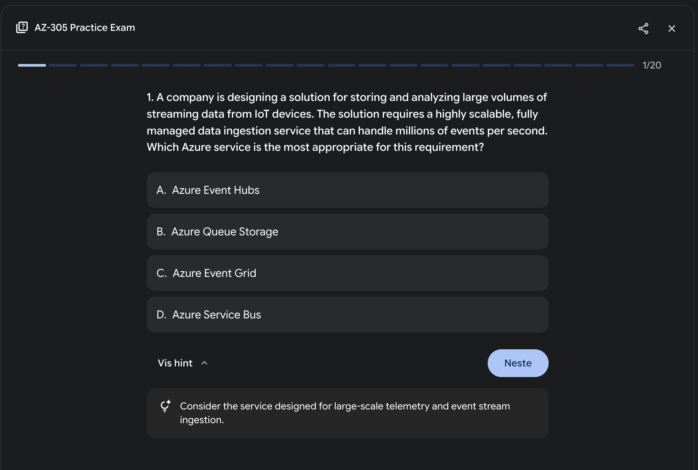
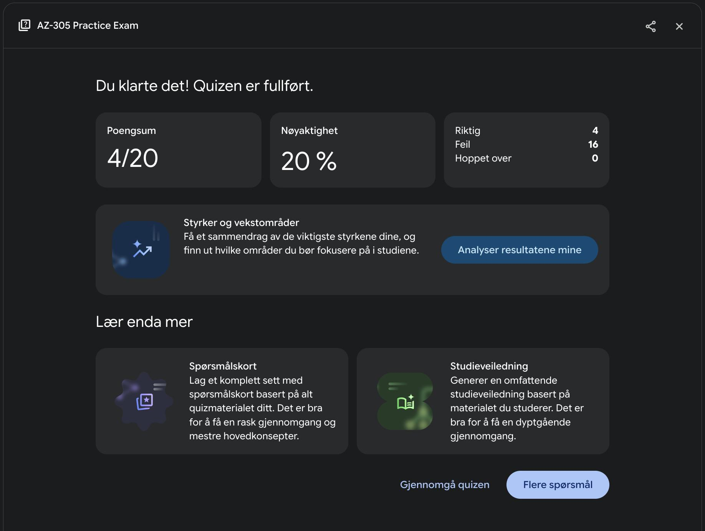

Passing an IT certification exam requires focused preparation. Generative AI can act as a powerful study partner, helping you refine your knowledge and test your skills efficiently. Here's a simple, effective workflow to integrate AI into your study routine.

## Build Your Foundation

Before using AI, you need raw material. Start by enrolling in a reputable course and taking your own notes. Focus on capturing key concepts, definitions, and processes related to the exam objectives. Don't worry about perfection, the goal is to create a solid information base.

### Enhance Your Notes with AI

Once you have your notes, use AI to transform them into a polished study guide. This step helps clarify complex topics, correct inaccuracies, and structure the content for better retention.

**Prompt template**:
```
Role: IT Certification Expert

Task:
Analyze, refine, and enhance my personal study notes for the specified IT certification exam.

Context:
- Exam: [Specify the full name and code of the exam, e.g., "CompTIA Security+ SY0-701"]
- Assessed Skills/Domains: [List the specific exam objectives or topics these notes cover, e.g., "1.1 Compare and contrast common security vulnerabilities and threats."]

Instructions:
1.Correct and clarify: Identify and correct any technical inaccuracies in my notes. Rephrase complex topics for better clarity.
2. Structure: Reorganize the content into a logical structure using markdown (headings, bullet points, tables, and bold text) for improved readability.
3. Enhance: Expand on the key concepts by adding critical details, simple analogies, or examples that are relevant to the exam objectives.
4. Focus: Ensure the final output is a concise, accurate, and exam-focused study guide based on my initial input.

# My Notes:
[Paste your raw study notes here]
```

## Test Your Knowledge With AI
Passive reading isn't enough. Recalling notes is crucial for success. Use AI to generate practice exams that simulate the real exam, helping you identify weak spots and get comfortable with the question format.

**Prompt template**:
```
Role: IT Certification Exam Simulator

Task:
Generate an interactive multiple-choice exam natively.

Context:
- Exam: [Specify the full name and code of the exam, e.g., "Google Cloud Certified - Professional Cloud Architect"]
- Assessed skills/domains:
    - [List the specific exam objectives or domains to be covered, e.g., "1. Designing and planning a cloud solution architecture"]
    - [e.g., "2. Managing and provisioning solution infrastructure"]
- Number of questions: [Specify the desired number of questions, e.g., 10]

Instructions:
1. Generate content: Create unique, scenario-based multiple-choice questions based on the specified domains. Each question must have one correct answer and three plausible distractors.
2. Format interactively: For each question, present the query and selectable options.
3. Reveal on selection: Upon selection of an option, immediately reveal whether the choice was correct or incorrect, and display a detailed explanation. The explanation must justify the correct answer and clarify why the other options are wrong.
```

> **Note:** Gemini 2.5 Pro is the only one *I know* that supports this feature natively.

Here's an example output with Google Gemini 2.5 Pro:



## Schedule and Pass the Exam
With your AI-enhanced notes and targeted practice, you'll be well-prepared. Review your materials one last time, schedule your exam, and take it with confidence. Good luck!