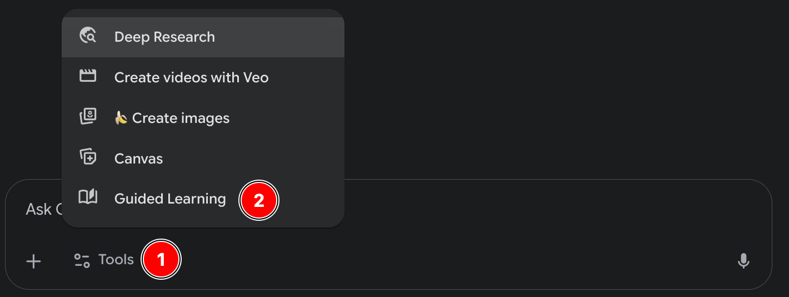
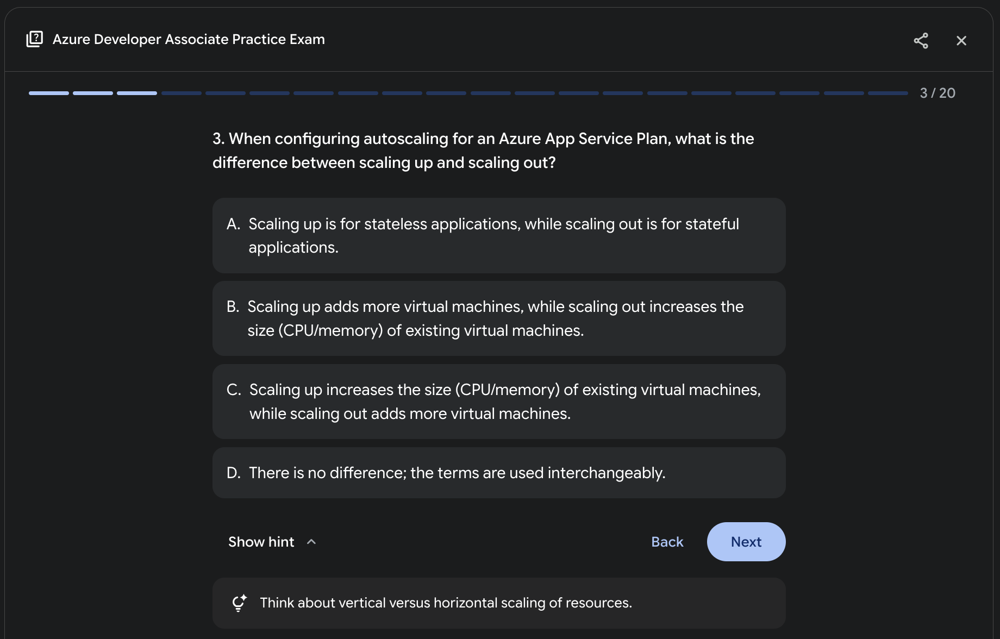
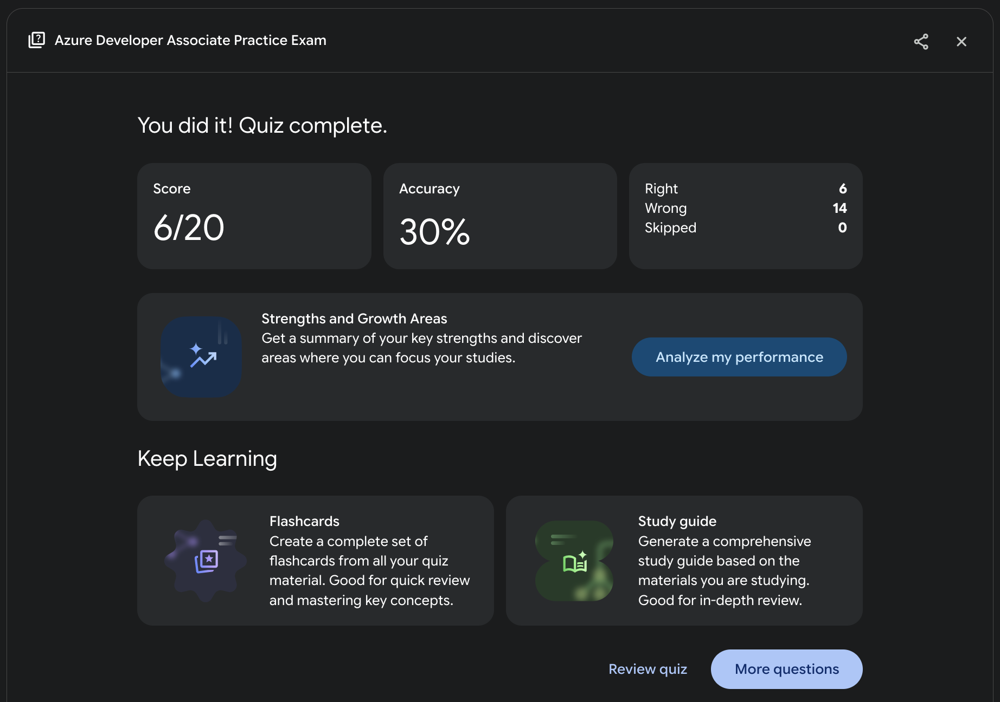
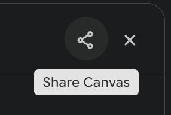

## Introduction
Generative AI can act as a powerful study partner, helping you refine your knowledge and test your skills efficiently. Here's a simple, effective workflow to integrate AI into your study routine.

## Prerequisites
- Access to **Google Gemini 2.5 Pro**.

## Build Your Foundation
Before using AI, you need raw material. Start by enrolling in a course and start taking your own notes. Focus on capturing key concepts, definitions, and processes related to the exam objectives. Don't worry about perfection, the goal is to create a solid information base.

## Enhance Your Notes
Once you have your notes, use AI to enhance them. This step helps clarify complex topics, correct inaccuracies, and structure the content for better retention.

1. Login to [gemini.google.com](https://gemini.google.com) and open a new chat.
2. Use the below prompt template and replace the context variables with your own. Remember to include your own notes at the bottom.
```yaml
Role: IT Certification Expert

Task: Analyze, refine, and enhance my personal study notes for the specified IT certification exam.

Context:
- Exam: Microsoft Certified - Azure Developer Associate
- Assessed skills/domains:
    - Develop Azure compute solutions
    - Develop for Azure storage
    - Implement Azure security
    - Monitor, troubleshoot, and optimize Azure solutions
    - Connect to and consume Azure services and third-party services

Instructions:
1. Correct and clarify: Identify and correct any technical inaccuracies in my notes. Rephrase complex topics for better clarity.
2. Structure: Reorganize the content into a logical structure using markdown (headings, bullet points, tables, and bold text) for improved readability.
3. Enhance: Expand on the key concepts by adding critical details, simple analogies, or examples that are relevant to the exam objectives.
4. Focus: Ensure the final output is a concise, accurate, and exam-focused study guide based on my initial input.

My Notes:
[Paste your raw study notes here]
```

## Create a Practice Exam
Passive reading is boring. Use AI to generate practice exams that simulate the real exam, helping you identify weak spots and get comfortable with the question format.

> **Note:** Gemini 2.5 Pro is the only one I know that supports this feature.

1. Login to [gemini.google.com](https://gemini.google.com) and open a new chat.
2. Tap the `Tools` button, then choose `Guided Learning`. 

3. Use the below prompt template and replace the context variables with your own. **NB!** You can optionally add your personal notes.
```yaml
Role: IT Certification Exam Simulator

Task: Generate an interactive multiple-choice exam natively.

Context:
- Exam: Microsoft Certified - Azure Developer Associate
- Assessed skills/domains:
    - Develop Azure compute solutions
    - Develop for Azure storage
    - Implement Azure security
    - Monitor, troubleshoot, and optimize Azure solutions
    - Connect to and consume Azure services and third-party services
- Number of questions: 20
```

This is how questions look. You can optionally view a hint for the question if you're struggling, and it will show you if you chose the correct one or not.


When you're finished you'll see a summary page like this. You can tell it to analyze the results so you get to know what you should study more, you can ask it to create flash cards based on the same test, and you can tell it to create a study guide.


You can even share it! Just press the share button and send the link. 



## Schedule and Pass the Exam
With your AI-enhanced notes and targeted practice, you'll be well-prepared. Review your materials one last time and schedule your exam!