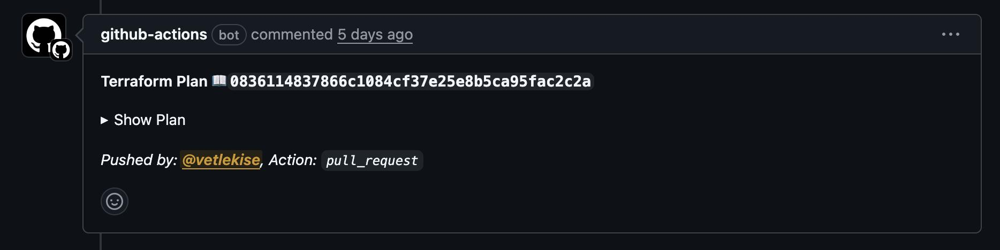
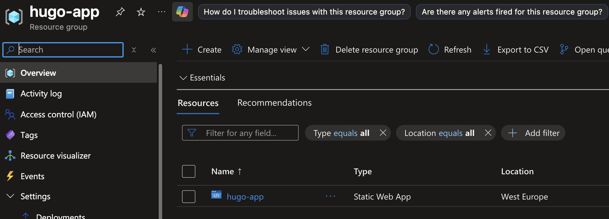
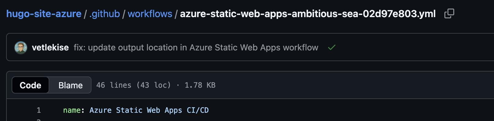
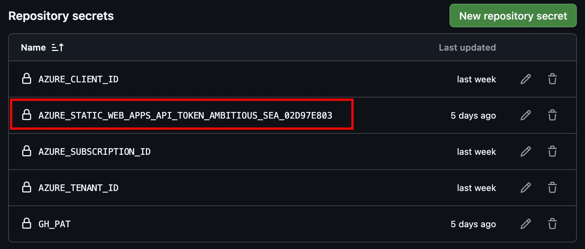
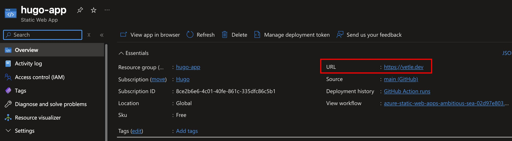
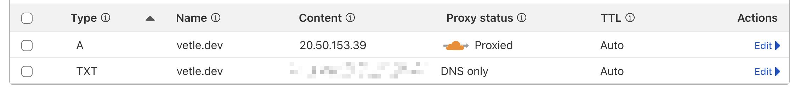

## Prerequisites
Before you begin, ensure you have the following set up.
- An **Azure** account with an active subscription. Make sure it has the Entra ID role `Application Administrator`, and Azure `Owner` role on the subscription.
- A **GitHub** account.
- **Locally installed tools**: Git, Azure CLI, and a code editor.
- **(Optional)** A custom domain name purchased from any registrar.

## Repository Setup
To streamline the process, a GitHub template is provided. This template contains all the necessary Terraform, GitHub Actions, and Hugo boilerplate files.
1. Navigate to the [GitHub template repository](https://github.com/vetlekise/hugo-site-azure-template). 
2. Click **Use this template** and select **Create a new repository**.
3. Provide a name and optional description, then click **Create repository**.
4. Clone your new repository to your local machine.

## Terraform Backend
Before Terraform can manage your Azure resources, we must create a secure, remote backend. This involves running a script to provision an Azure Storage Account for Terraform's state and a Service Principal for authentication.
1. Locate the file `./tools/azure-backend.sh` in your repository.
2. Open the file and configure the environment variables with your specific details.
```bash
RESOURCE_GROUP_NAME="hugo"
STORAGE_ACCOUNT_NAME="tfstatehugo<INSERT RANDOM NUMBERS>" # must be globally unique"
CONTAINER_NAME="tfstate"
LOCATION="" # e.g. "eastus" or "norwayeast"
APP_NAME="Hugo - GitHub Actions"
YOUR_GITHUB_ORG="" # e.g. "my-github-username" or "my-github-organization"
YOUR_REPO_NAME=""
```
3. Run the script from your terminal. You'll be prompted to log into Azure.
4. After completion, the script will output several important values. **Save these**, as you will need them for the next steps.

## GitHub Authentication
To allow secure communication between Azure and GitHub, you need to create two sets of credentials: a Personal Access Token (PAT) for Azure to update your repository, and GitHub secrets for your workflows to authenticate with Azure.

### Create a Personal Access Token (PAT)
1. Create a [fine-grained PAT](https://docs.github.com/en/authentication/keeping-your-account-and-data-secure/managing-your-personal-access-tokens#creating-a-fine-grained-personal-access-token) on GitHub.
2. Grant it the following repository permissions:
    - `Contents: Read and write`
    - `Workflows: Read and write`
    - `Secrets: Read and write`
2. Copy the generated token and save it securely.

### Create GitHub Secrets
1. In your repository settings, go to `Secrets and variables` > `Actions`.
2. Create the following secrets using the values from the backend script output and the PAT you just created:
    - `AZURE_CLIENT_ID`
    - `AZURE_SUBSCRIPTION_ID`
    - `AZURE_TENANT_ID`
    - `GH_PAT`

## Deploy Infrastructure
With authentication configured, you can now deploy the Azure infrastructure using Terraform. This is handled automatically through a pull request workflow.
1. Create a new Git branch.
2. Open `./infra/variables.tf` and edit the default values. For now, leave the custom domain variables unchanged.
3. Commit your changes and push the branch to GitHub.
4. Create a pull request. The workflow will automatically run and show you a `terraform plan` in a PR omment.

5. Review the plan. If it's correct, merge the pull request to deploy the resources.

6. After merging, a new workflow file and a new secret will be automatically added to your repository by Azure.



## Deploy Hugo Site
The final step is to configure the deployment pipeline to correctly build your Hugo site from the `src` directory and deploy it to the new Static Web App.
1. Create a new branch, ensuring you've pulled the latest changes from `main`.
2. Find the new workflow file at `./.github/workflows/azure-static-web-apps-<RANDOM_ID>.yml`.
3. Modify the file to set the `app_location` and `output_location`.
```yaml
...
action: "upload"
app_location: "src" # <--
api_location: ""
output_location: "public" # <--
...
```
4. Commit the change, create a pull request, and merge it.
5. Once the pipeline succeeds, your Hugo website will be live! Check the Azure Portal for the URL.


## Hugo Configuration
Once your site is deployed, you can manage its content and configuration. Here’s how to work with your Hugo site's structure.
1. The `hugo.toml` file is the main configuration for your site. Here you can add your title, description, and generally change a bunch of settings. 
    - **NB!** For your domain to work you'll have to customize the `baseURL` to match your domain.
2. `./content/page/*`contains menu pages, like the `About` page.
3. `./content/post/*` contains your blog posts. Add a new directory for each post with an `index.md` file.
4. At the top of your `index.md file`, add YAML frontmatter to configure the post. Here's an example with most of the possible config:
```yaml
---
title: Example
slug: example # This is the name that will be in your URL, e.g. https://domain.tld/post/example
description: Hugo, the world's fastest framework for building websites
date: '2019-02-28'
lastmod: '2020-10-09'
categories:
    - Example
tags:
    - Example
aliases:
  - example
license: CC BY-NC-ND
image: cover.jpg # Resolution: 1000 px × 667 px
weight: 1 # You can add weight to some posts to override the default sorting (date descending)
menu:
    main: 
        weight: 1
        params:
            icon: user
---
```
5. Below the frontmatter, write your content in Markdown.
6. Push changes to the `main` branch to trigger an automatic deployment.

## (Optional) Add a Custom Domain
If you wish to use your own domain, you'll need to update the Terraform configuration and then validate the domain in the Azure portal.
1. In `./infra/variables.tf`, set `add_custom_domain` to true and `custom_domain` to your domain name.
2. Commit, push, and merge these changes via a pull request.
3. In the Azure Portal, find your Static Web App and go to the `Custom domains` section.
4. Follow the instructions to add a `TXT` record and an `A` record to your domain's DNS settings at your registrar.


6. This is how the DNS configuration should look like at your registrar. This example uses Cloudflare:

7. Wait for DNS propagation. This may take a few minutes to a few hours.

## Resources & Links
For more detailed information on Hugo and the theme used in the template, please refer to the official documentation.
- [Hugo Docs](https://gohugo.io/)
- [Stack Theme Docs](https://stack.jimmycai.com/config/)
- [Stack Theme Starter Repository](https://github.com/CaiJimmy/hugo-theme-stack-starter/)