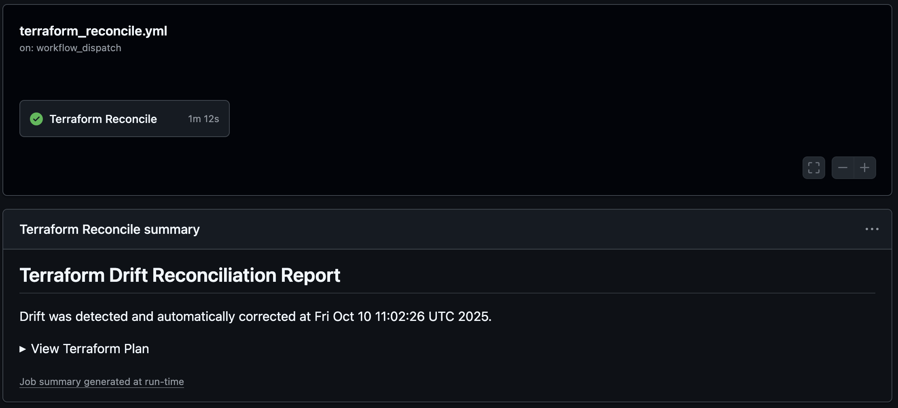
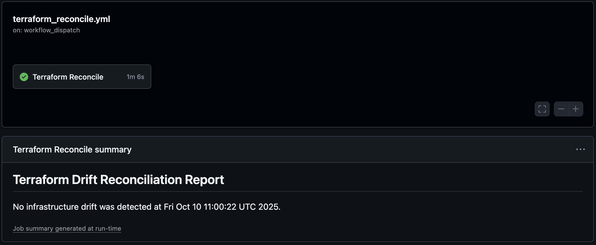
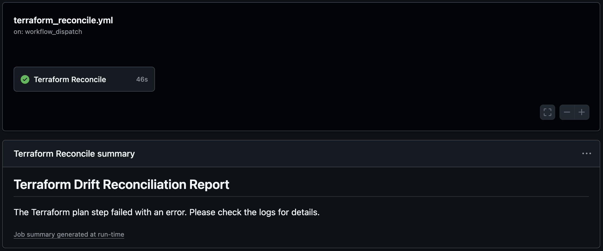

## What is Terraform Drift?

Drift is the term for when the real-world state of your infrastructure differs from the state defined in your configuration.


It can be caused by many things, but urgent hotfixes and teams being unfamiliar with Infrastructure as Code (IaC) practices is the most likely cause. Its a significant problem because it undermines the core benefits of IaC. 

The main issue is the loss of a single source of truth. When your code and infra tell different stories, you can no longer trust your code to be an accurate representation of your environment.

## Applying GitOps Principals to Infrastructure

GitOps is an operational framework that takes DevOps best practices used for application development such as version control, collaboration, compliance, and CI/CD, and applies them to infrastructure automation.


The core idea is simple:
1. **Describe** your entire desired infrastructure in a Git repository using declarative code.
2. **Automate** the process that coninuously compares this desired state with the actual state of your live infrastructure.
3. **Correct** any detected differences, ensuring the live environment always reflects the state defined in Git.

By adopting this workflow, you treat your infrastructure the same as your application code. Changes are made via pull requests, reviewed by peers, and automatically deployed. This creates an audit trail and, most importantly, provides a mechanism for automatically correcting drift.

## Designing the Reconciliation Pipeline
To combat drift, we can build an automated reconciliation pipeline. This pipeline will periodically check for discrepancies and take action. Here's two approaches:
1. **Detection-only**
    - The pipeline runs `terraform plan` on a schedule. If it detects any differences, it doesn't apply them. Instead, it sends an alert to your team via Slack, creates a GitHub issue, or logs a warning. This approach is safer and gives your team full control over when and how to resolve the drift.
2. **Auto-correction**
    - This is the full GitOps approach. The pipeline runs `terraform plan` to detect drift and, if any is found, immediately runs `terraform apply` to automatically revert the infrastructure to the state defined in your code. This ensures your infrastructure is always in sync, but this requires a high degree of confidence in your automation and testing.

## Building the Pipeline with GitHub Actions
Our goal is to create the **auto-correction** pipeline that runs on a schedule, checks for drift, and automatically applies the correct config if any drift is found.

Create a new file in your repository at `.github/workflows/terraform-reconcile.yml` and add the following code:
```yaml
name: 'Terraform Drift Reconciliation'

on:
  # Allows you to run this workflow manually from the Actions tab
  workflow_dispatch:

  # Runs on a schedule (e.g., every day at 2:00 AM UTC)
  schedule:
    - cron: '0 2 * * *'

jobs:
  terraform-reconcile:
    name: 'Terraform Reconcile'
    runs-on: ubuntu-latest

    steps:
      - name: Checkout
        uses: actions/checkout@v5

      - name: Setup Terraform
        uses: hashicorp/setup-terraform@v3

      # ... Add step for authenticating to provider

      - name: Terraform Init
        id: init
        run: terraform init

      - name: Terraform Plan
        continue-on-error: true
        id: plan
        run: |
          plan_output=$(terraform plan -no-color -out=tfplan 2>&1)
          echo "${plan_output}"
          
          echo "drift_detected=false" >> $GITHUB_OUTPUT
          
          echo "plan_text<<EOF" >> $GITHUB_OUTPUT
          echo "${plan_output}" >> $GITHUB_OUTPUT
          echo "EOF" >> $GITHUB_OUTPUT
          
          if echo "${plan_output}" | grep -q 'Plan:'; then
            if ! echo "${plan_output}" | grep -q 'No changes.'; then
              echo "Drift detected. Setting drift_detected=true"
              echo "drift_detected=true" >> $GITHUB_OUTPUT
            fi
          fi
          
          if ! echo "${plan_output}" | grep -q -e 'Plan:' -e 'No changes.'; then
            echo "::error::Terraform plan failed with an error."
            exit 1
          fi

      - name: Terraform Apply
        if: steps.plan.outputs.drift_detected == 'true'
        run: terraform apply -auto-approve "tfplan"

      - name: Post Summary - Drift Found
        if: steps.plan.outputs.drift_detected == 'true'
        env:
          PLAN_TEXT: ${{ steps.plan.outputs.plan_text }}
        run: |
          echo "## Terraform Drift Reconciliation Report" >> $GITHUB_STEP_SUMMARY
          echo "Drift was detected and automatically corrected at $(date)." >> $GITHUB_STEP_SUMMARY
          echo "" >> $GITHUB_STEP_SUMMARY
          echo "<details><summary>View Terraform Plan</summary>" >> $GITHUB_STEP_SUMMARY
          echo "" >> $GITHUB_STEP_SUMMARY
          echo '```terraform' >> $GITHUB_STEP_SUMMARY
          echo "$PLAN_TEXT" >> $GITHUB_STEP_SUMMARY
          echo '```' >> $GITHUB_STEP_SUMMARY
          echo "</details>" >> $GITHUB_STEP_SUMMARY
          
      - name: Post Summary - Drift Not Found
        if: steps.plan.outputs.drift_detected == 'false'
        run: |
          echo "## Terraform Drift Reconciliation Report" >> $GITHUB_STEP_SUMMARY
          echo "No infrastructure drift was detected at $(date)." >> $GITHUB_STEP_SUMMARY

      - name: Post Summary - Plan Error
        if: steps.plan.outcome == 'failure'
        run: |
          echo "## Terraform Drift Reconciliation Report" >> $GITHUB_STEP_SUMMARY
          echo "The Terraform plan step failed with an error. Please check the logs for details." >> $GITHUB_STEP_SUMMARY
```

This workflow builds a custom output (`steps.plan.outputs.drift_detected`) during the `plan` step that is used by the other steps.

I tried using the [-detailed-exitcode](https://developer.hashicorp.com/terraform/cli/commands/plan#detailed-exitcode) flag for `terraform plan` in combination with conditionals for posting summaries, but GitHub Actions must have some sort of bug, because it didn't output the correct exit codes.





## Best Practices and Considerations
Before deploying this in a production environment, consider the following:
- **Start with** `detection-only`
    - Begin by removing the `terraform apply` step and adding a notification step instead. Let the pipeline run for a while to see how often drift occurs.
- **Limit scope**
    - Initially, run this pipeline only on non-critical environments, like development.
- **Secure your credentials**
    - OIDC is the most secure way to authenticate with your provider, as it provides short-lived, automatically rotating credentials.
- **Use notifications**
    - Even with auto-correction, you can still notify your team when drift is detected and corrected. Consider adding a step to send a message to a Slack channel to keep everyone informed.
- **Role-based access control (RBAC)**
    - The user that did a manual change (ClickOps), do they really need permission to do so?

## Conclusion
Drift is natural when managing complex systems, expecially in immature environments where processes haven't been fully developed. By implementing an automated reconciliation pipeline, you eliminate configuration drift, and create a more stable and predictable environment.