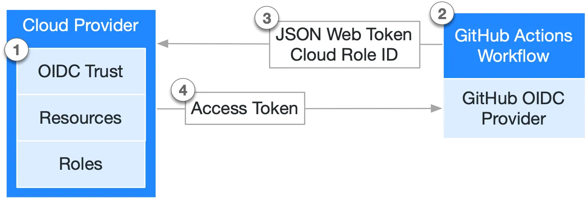

## What is OIDC?
**OIDC** stands for **OpenID Connect**. It's an identity layer built on top of the OAuth 2.0 framework.

In simple terms, it allows one application (like a GitHub Actions workflow) to securely prove its identity to another application (like a cloud provider such as Azure) without using static, long-lived secrets. Instead of a password or an access key, the system uses a short-lived, verifiable ID Token. This process of exchanging a temporary token is often called a "federated identity" workflow and is a much more secure way to manage authentication for automated processes.

The below example shows the basic workflow with GitHub Actions:


## Prerequisites
Before you begin, ensure you have the following.
- A **GitHub repository** must already be created.
- An **Azure** account with an active subscription. Make sure it has the Entra ID role `Application Administrator`, and Azure `Owner` role on the subscription.
- **Locally installed tools**: [Git](https://git-scm.com/downloads), [Azure CLI](https://learn.microsoft.com/en-us/cli/azure/install-azure-cli?view=azure-cli-latest), and a code editor.

## Azure Resources
We need to create a few Azure resources, specifically a **Resource Group** containing a **Storage Account**. This will store our Terraform state file securely and offer state locking. The below **Azure CLI** script will create these resources for us, you just need to provide some values first. You'll be prompted to login with your **Azure** account, use the one that has access to create resources in your desired Subscription.

```bash
# Login with your Azure account
az login

RESOURCE_GROUP_NAME="terraform"
STORAGE_ACCOUNT_NAME="tfstate<INSERT RANDOM NUMBERS>" # must be globally unique"
CONTAINER_NAME="tfstate"
LOCATION="" # e.g. "eastus" or "westeurope"

# Create the resource group
az group create --name $RESOURCE_GROUP_NAME --location $LOCATION

# Create the storage account
az storage account create --name $STORAGE_ACCOUNT_NAME --resource-group $RESOURCE_GROUP_NAME --sku Standard_LRS --encryption-services blob

# Create a blob container within the storage account
az storage container create --name $CONTAINER_NAME --account-name $STORAGE_ACCOUNT_NAME
```

## Service Principal
For the pipeline to authenticate, we need to create a **Service Principal** in **Entra ID**. The script creates this for us, in addition to that, it creates the **federated tokens** needed for GitHub Actions to authenticate to Azure, and it also creates a couple of **RBAC assignments** needed for Terraform to manage the state file and create resources. Before running, remember to edit the variables at the top! (You should already be logged in from the previous script)
```bash
APP_NAME="GitHub Actions - OIDC"
YOUR_GITHUB_ORG="" # e.g. "my-github-username" or "my-github-organization"
YOUR_REPO_NAME=""

# Get the necessary IDs
AZURE_SUBSCRIPTION_ID=$(az account show --query id -o tsv)
AZURE_CLIENT_ID=$(az ad app create --display-name "$APP_NAME" --query appId -o tsv)

# Create the Service Principal for the new App
az ad sp create --id $AZURE_CLIENT_ID

# Grant the Service Principal read and write permission over your subscription control plane
az role assignment create \
  --role "Contributor" \
  --assignee-object-id $(az ad sp show --id $AZURE_CLIENT_ID --query id -o tsv) \
  --assignee-principal-type ServicePrincipal \
  --scope "/subscriptions/$AZURE_SUBSCRIPTION_ID"

# Grant the Service Principal read and write permission over your storage account data plane
az role assignment create \
  --role "Storage Blob Data Contributor" \
  --assignee-object-id $(az ad sp show --id $AZURE_CLIENT_ID --query id -o tsv) \
  --assignee-principal-type ServicePrincipal \
  --scope "/subscriptions/$AZURE_SUBSCRIPTION_ID/resourceGroups/$RESOURCE_GROUP_NAME/providers/Microsoft.Storage/storageAccounts/$STORAGE_ACCOUNT_NAME"

# Create the federated credential trust between your Service Principal and GitHub
az ad app federated-credential create \
  --id $AZURE_CLIENT_ID \
  --parameters '{"name":"github-main-branch","issuer":"https://token.actions.githubusercontent.com","subject":"repo:'$YOUR_GITHUB_ORG'/'$YOUR_REPO_NAME':ref:refs/heads/main","description":"Trust main branch","audiences":["api://AzureADTokenExchange"]}'

az ad app federated-credential create \
  --id $AZURE_CLIENT_ID \
  --parameters '{"name":"github-pull-requests","issuer":"https://token.actions.githubusercontent.com","subject":"repo:'$YOUR_GITHUB_ORG'/'$YOUR_REPO_NAME':pull_request","description":"Trust pull requests","audiences":["api://AzureADTokenExchange"]}'

echo "AZURE_CLIENT_ID: $AZURE_CLIENT_ID"
echo "AZURE_TENANT_ID: $(az account show --query tenantId -o tsv)"
echo "AZURE_SUBSCRIPTION_ID: $AZURE_SUBSCRIPTION_ID"
```

> **Note**: Save the values echo'd after the script is finished. These will be used in the next step to create variables in your GitHub repository.

## GitHub Variables
Next up, we are creating variables in your GitHub repository. These will be called by the GitHub Actions workflow to locate the Azure backend. I've decided to use variables for this since its easily accessible without changing the code itself.
1. Login to [GitHub](github.com) and locate your repository.
2. In your repository settings, go to `Secrets and variables` > `Actions`.
3. Create the following variables using the values from the previous script:
    - `ARM_CLIENT_ID`
    - `ARM_SUBSCRIPTION_ID`
    - `ARM_TENANT_ID`
    - `RESOURCE_GROUP_NAME`
    - `STORAGE_ACCOUNT_NAME`
    - `CONTAINER_NAME`
    - `KEY`

## Terraform Configuration
For the `azurerm` provider to work with OIDC, we need to change some settings. 
1. In your repository, create a Terraform configuration file, for example `versions.tf`.
2. Open the newly created file and paste in the below code block. Notice the provider settings, `use_oidc` and `use_azuread_auth`. These must be set to `true` for our pipeline to authenticate.
```terraform
terraform {
  required_providers {
    azurerm = {
      source  = "hashicorp/azurerm"
      version = "~>4.0"
    }
  }
  backend "azurerm" {
    use_oidc             = true 
    use_azuread_auth     = true
  }
}

provider "azurerm" {
  features {}
}
```

## GitHub Actions Workflow
In this next step, we are going to create the workflow used by GitHub Actions to deploy our Terraform resources.
1. In your repository, create a new directory and file called `.github/workflows/terraform.yml`. This file will contain our pipeline.
2. Open the newly created file and paste in the below code block. This workflow is built with some best practices in mind. The `plan` job runs on Pull Requests to main, uploads the plan binary as an artifact, and creates a comment in your PR with the plan changes. The `apply` job runs on Push to main, downloads the plan binary from the artifact, and pushes your changes.
```yaml
name: 'Terraform'

on:
  # Trigger on pull requests targeting the main branch
  pull_request:
    branches:
      - main
    paths:
      - '**.tf'
  
  # Trigger on pushes (merges) to the main branch
  push:
    branches:
      - main
    paths:
      - '**.tf'

env:
  ARM_CLIENT_ID: ${{ vars.ARM_CLIENT_ID }}
  ARM_SUBSCRIPTION_ID: ${{ vars.ARM_SUBSCRIPTION_ID }}
  ARM_TENANT_ID: ${{ vars.ARM_TENANT_ID }}
  RESOURCE_GROUP_NAME: ${{ vars.RESOURCE_GROUP_NAME }}
  STORAGE_ACCOUNT_NAME: ${{ vars.STORAGE_ACCOUNT_NAME }}
  CONTAINER_NAME: ${{ vars.CONTAINER_NAME }}
  KEY: ${{ vars.KEY }}

# Required for OIDC login and for posting PR comments
permissions:
  id-token: write
  contents: read
  pull-requests: write

jobs:
  # This job runs on pull requests to generate a plan
  plan:
    name: 'Terraform Plan'
    runs-on: ubuntu-latest
    # The plan job will only run for pull request events
    if: >-
      (github.event_name == 'pull_request')
      ||
      (github.event_name == 'push' && github.ref == 'refs/heads/main')

    steps:
    - name: Checkout
      uses: actions/checkout@v4

    - name: Azure Login
      uses: azure/login@v2
      with:
        client-id: ${{ env.ARM_CLIENT_ID }}
        tenant-id: ${{ env.ARM_TENANT_ID }}
        subscription-id: ${{ env.ARM_SUBSCRIPTION_ID }}

    - name: Setup Terraform
      uses: hashicorp/setup-terraform@v3

    - name: Terraform Init
      run: terraform init -backend-config="resource_group_name=${{ env.RESOURCE_GROUP_NAME }}" -backend-config="storage_account_name=${{ env.STORAGE_ACCOUNT_NAME }}" -backend-config="container_name=${{ env.CONTAINER_NAME }}" -backend-config="key=${{ env.KEY }}"

    - name: Terraform Validate
      run: terraform validate -no-color

    - name: Terraform Plan
      id: plan
      run: terraform plan -no-color -out="tfplan"
      # We continue on error so the PR comment step can report the failure
      continue-on-error: true

    - name: Post Plan Comment to PR
      uses: actions/github-script@v7
      env:
        PLAN: "terraform\n${{ steps.plan.outputs.stdout }}"
      with:
        script: |
          const { PLAN } = process.env;
          const output = `#### Terraform Plan 📖\`${{ github.event.pull_request.head.sha }}\`
          <details><summary>Show Plan</summary>
          
          \`\`\`\n${PLAN}\n\`\`\`
          
          </details>
          
          *Pushed by: @${{ github.actor }}, Action: \`${{ github.event_name }}\`*`;
          
          await github.rest.issues.createComment({
            owner: context.repo.owner,
            repo: context.repo.repo,
            issue_number: context.issue.number,
            body: output
          });
          
          if ("${{ steps.plan.outcome }}" == "failure") {
            process.exit(1);
          }
          
    - name: Upload Terraform Plan Artifact
      if: steps.plan.outcome == 'success'
      uses: actions/upload-artifact@v4
      with:
        name: terraform-plan
        path: tfplan
        retention-days: 1

  # This job runs only after a PR is merged into main
  apply:
    name: 'Terraform Apply'
    needs: plan
    runs-on: ubuntu-latest
    # The apply job only runs on a push to main
    if: github.event_name == 'push' && github.ref == 'refs/heads/main' && needs.Plan.result == 'success'

    steps:
    - name: Checkout
      uses: actions/checkout@v4

    - name: Azure Login
      uses: azure/login@v2
      with:
        client-id: ${{ env.ARM_CLIENT_ID }}
        tenant-id: ${{ env.ARM_TENANT_ID }}
        subscription-id: ${{ env.ARM_SUBSCRIPTION_ID }}

    - name: Setup Terraform
      uses: hashicorp/setup-terraform@v3

    - name: Terraform Init
      run: terraform init -backend-config="resource_group_name=${{ env.RESOURCE_GROUP_NAME }}" -backend-config="storage_account_name=${{ env.STORAGE_ACCOUNT_NAME }}" -backend-config="container_name=${{ env.CONTAINER_NAME }}" -backend-config="key=${{ env.KEY }}"
    
    - name: Download Terraform Plan Artifact
      uses: actions/download-artifact@v4
      with:
        name: terraform-plan

    - name: Terraform Apply
      run: terraform apply -auto-approve "tfplan"
```

If you've followed all the steps, run the pipeline, it should then authenticate to Azure using OIDC, create a plan on PRs, and deploy changes on merges to main.

## Resources & Links
For more detailed information on authentication to the Terraform backend in Azure, please refer to the official documentation.
- [HashiCorp - azurerm](https://developer.hashicorp.com/terraform/language/backend/azurerm)
- [Provider Documentation](https://registry.terraform.io/providers/hashicorp/azurerm/latest/docs/guides/service_principal_oidc)