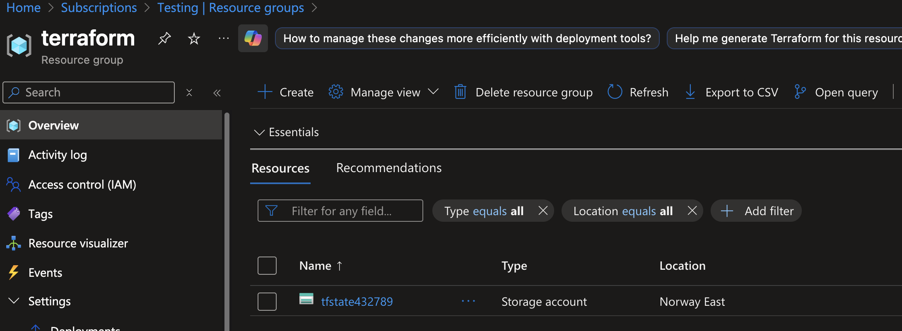
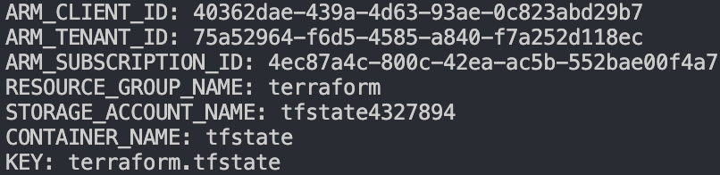
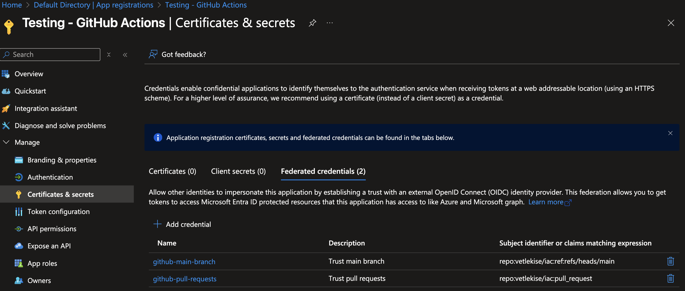
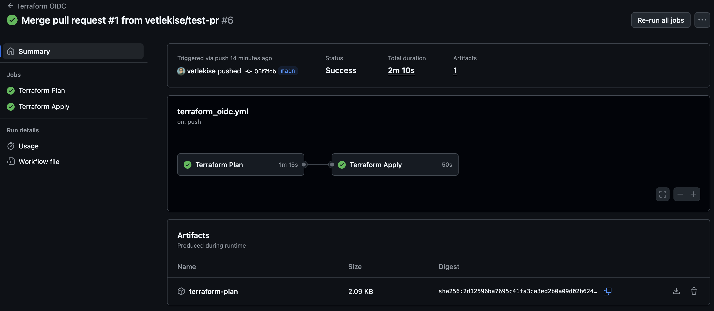

## What is OIDC?
**OIDC** stands for **OpenID Connect**. It's an identity layer built on top of the OAuth 2.0 framework.

In simple terms, it allows one application (like a GitHub Actions workflow) to securely prove its identity to another application (like a cloud provider such as Azure) without using static, long-lived secrets. Instead, the system uses a short-lived, verifiable ID Token. This process of exchanging a temporary token is often called a "federated identity" workflow and is a much more secure way to manage authentication for automated processes.


## Prerequisites
Before you begin, ensure you have the following.
- A **GitHub repository** must already be created.
- An **Microsoft** account with an active **Azure Subscription**. Make sure the account has the Entra ID role `Application Administrator`, and Azure `Owner` role assigned to the subscription. In addition, the subscription needs the `Microsoft.Storage` resource provider registered.
- **Locally installed tools**: [Git](https://git-scm.com/downloads), [Azure CLI](https://learn.microsoft.com/en-us/cli/azure/install-azure-cli?view=azure-cli-latest), and a code editor.

## Azure Resources
First, we need to create a few Azure resources, specifically a **Resource Group** containing a **Storage Account**. This will store our Terraform state file securely and offer state locking. The below **Azure CLI** script will create these resources for us, you just need to provide some values first by exporting them as environment variables. 

```bash
export RESOURCE_GROUP_NAME="terraform"
export STORAGE_ACCOUNT_NAME="tfstate<INSERT RANDOM NUMBERS>"
export CONTAINER_NAME="tfstate"
export LOCATION=""
```

Now run the below script. When you're prompted for login, use the Azure account that has permissions to create resources in your desired Subscription.

```bash
az login

az group create --name $RESOURCE_GROUP_NAME --location $LOCATION

az storage account create --name $STORAGE_ACCOUNT_NAME --resource-group $RESOURCE_GROUP_NAME --sku Standard_LRS --encryption-services blob

az storage container create --name $CONTAINER_NAME --account-name $STORAGE_ACCOUNT_NAME
```

You should now have something like this in your Subscription:


## Service Principal
For the pipeline to authenticate, we need to create a **Service Principal** in **Entra ID**. The below script creates this for us, in addition to that, it creates the **federated tokens** needed for GitHub Actions to authenticate to Azure, and it also creates a couple of **RBAC assignments** needed for Terraform to manage the state file and create resources. Before running, export these environment variables:

```bash
export APP_NAME="GitHub Actions - OIDC"
export YOUR_GITHUB_ORG=""
export YOUR_REPO_NAME=""
```

Now run the below script. You should already be logged in from the previous script, if not, add `az login`.
```bash
AZURE_SUBSCRIPTION_ID=$(az account show --query id -o tsv)
AZURE_CLIENT_ID=$(az ad app create --display-name "$APP_NAME" --query appId -o tsv)

az ad sp create --id $AZURE_CLIENT_ID

az role assignment create \
  --role "Contributor" \
  --assignee-object-id $(az ad sp show --id $AZURE_CLIENT_ID --query id -o tsv) \
  --assignee-principal-type ServicePrincipal \
  --scope "/subscriptions/$AZURE_SUBSCRIPTION_ID"

az role assignment create \
  --role "Storage Blob Data Contributor" \
  --assignee-object-id $(az ad sp show --id $AZURE_CLIENT_ID --query id -o tsv) \
  --assignee-principal-type ServicePrincipal \
  --scope "/subscriptions/$AZURE_SUBSCRIPTION_ID/resourceGroups/$RESOURCE_GROUP_NAME/providers/Microsoft.Storage/storageAccounts/$STORAGE_ACCOUNT_NAME"

az ad app federated-credential create \
  --id $AZURE_CLIENT_ID \
  --parameters '{"name":"github-main-branch","issuer":"https://token.actions.githubusercontent.com","subject":"repo:'$YOUR_GITHUB_ORG'/'$YOUR_REPO_NAME':ref:refs/heads/main","description":"Trust main branch","audiences":["api://AzureADTokenExchange"]}'

az ad app federated-credential create \
  --id $AZURE_CLIENT_ID \
  --parameters '{"name":"github-pull-requests","issuer":"https://token.actions.githubusercontent.com","subject":"repo:'$YOUR_GITHUB_ORG'/'$YOUR_REPO_NAME':pull_request","description":"Trust pull requests","audiences":["api://AzureADTokenExchange"]}'

echo "ARM_CLIENT_ID: $AZURE_CLIENT_ID"
echo "ARM_TENANT_ID: $(az account show --query tenantId -o tsv)"
echo "ARM_SUBSCRIPTION_ID: $AZURE_SUBSCRIPTION_ID"
echo "RESOURCE_GROUP_NAME: $RESOURCE_GROUP_NAME"
echo "STORAGE_ACCOUNT_NAME: $STORAGE_ACCOUNT_NAME"
echo "CONTAINER_NAME: $CONTAINER_NAME"
echo "KEY: terraform.tfstate"
```

Save the echo'd values after the script is finished! These will be used in the next step to configure the Terraform backend.


You should now have a service principal with these two tokens. One for authenticating in a pull request to main and another for pushing to main.


## Terraform Configuration
For the `azurerm` provider to work with OIDC, we need to change some settings and add some variables. 
1. In your repository, create a Terraform configuration file, for example `versions.tf`.
2. Open the newly created file and paste in the below code block. Notice the provider settings, `use_oidc` and `use_azuread_auth`. These must be set to `true` for our pipeline to authenticate.
3. Input the missing variables in `backend "azurerm"` using the values from the previous script.
```terraform
terraform {
  required_providers {
    azurerm = {
      source  = "hashicorp/azurerm"
      version = "~>4.0"
    }
  }
  backend "azurerm" {
    use_oidc             = true 
    use_azuread_auth     = true

    resource_group_name  = ""
    storage_account_name = ""
    container_name       = ""
    key                  = ""
  }
}

provider "azurerm" {
  features {}
}
```

## GitHub Actions Workflow
In this next step, we are going to create the workflow used by GitHub Actions to deploy our Terraform resources.
1. In your repository, create a new directory and file called `.github/workflows/terraform.yml`. This file will contain our pipeline.
2. Open the newly created file and paste in the below code block. This workflow is built with some best practices in mind. The `plan` job runs on Pull Requests to main, uploads the plan binary as an artifact, and creates a comment in your PR with the plan changes. The `apply` job runs on Push to main, downloads the plan binary from the artifact, and pushes your changes.
3. For the pipeline to work properly, edit the `env` values using the output from the previous script.
```yaml
name: 'Terraform OIDC'

on:
  # Trigger on pull requests targeting the main branch
  pull_request:
    types: ["opened", "synchronize", "reopened"]
    branches: ["main"]
    paths: ["terraform_oidc/**.tf"]

  # Trigger on pushes (merges) to the main branch
  push:
    branches: ["main"]
    paths: ["terraform_oidc/**.tf"]

env:
  ARM_CLIENT_ID: ""
  ARM_SUBSCRIPTION_ID: ""
  ARM_TENANT_ID: ""

# Required for OIDC login and for posting PR comments
permissions:
  id-token: write
  contents: read
  pull-requests: write

jobs:
  plan:
    name: 'Terraform Plan'
    runs-on: ubuntu-latest
    if: >-
      (github.event_name == 'pull_request')
      ||
      (github.event_name == 'push' && github.ref == 'refs/heads/main')

    steps:
    - name: Checkout
      uses: actions/checkout@v5

    - name: Azure Login
      uses: azure/login@v2
      with:
        client-id: ${{ env.ARM_CLIENT_ID }}
        tenant-id: ${{ env.ARM_TENANT_ID }}
        subscription-id: ${{ env.ARM_SUBSCRIPTION_ID }}

    - name: Setup Terraform
      uses: hashicorp/setup-terraform@v3

    - name: Terraform Init
      run: terraform init

    - name: Terraform Validate
      run: terraform validate -no-color

    - name: Terraform Plan
      id: plan
      run: terraform plan -no-color -out="tfplan"
      continue-on-error: true

    - name: Post Plan Comment to PR
      if: github.event_name == 'pull_request'
      uses: actions/github-script@v8
      env:
        PLAN: "terraform\n${{ steps.plan.outputs.stdout }}"
      with:
        script: |
          const { PLAN } = process.env;
          const output = `#### Terraform Plan 📖\`${{ github.event.pull_request.head.sha }}\`
          <details><summary>Show Plan</summary>
          
          \`\`\`\n${PLAN}\n\`\`\`
          
          </details>
          
          *Pushed by: @${{ github.actor }}, Action: \`${{ github.event_name }}\`*`;
          
          await github.rest.issues.createComment({
            owner: context.repo.owner,
            repo: context.repo.repo,
            issue_number: context.issue.number,
            body: output
          });
          
          if ("${{ steps.plan.outcome }}" == "failure") {
            process.exit(1);
          }
          
    - name: Upload Terraform Plan Artifact
      if: steps.plan.outcome == 'success'
      uses: actions/upload-artifact@v4
      with:
        name: terraform-plan
        path: tfplan
        retention-days: 1

  apply:
    name: 'Terraform Apply'
    needs: plan
    runs-on: ubuntu-latest
    if: github.event_name == 'push' && github.ref == 'refs/heads/main' && needs.Plan.result == 'success'

    steps:
    - name: Checkout
      uses: actions/checkout@v5

    - name: Azure Login
      uses: azure/login@v2
      with:
        client-id: ${{ env.ARM_CLIENT_ID }}
        tenant-id: ${{ env.ARM_TENANT_ID }}
        subscription-id: ${{ env.ARM_SUBSCRIPTION_ID }}

    - name: Setup Terraform
      uses: hashicorp/setup-terraform@v3

    - name: Terraform Init
      run: terraform init
    
    - name: Download Terraform Plan Artifact
      uses: actions/download-artifact@v5
      with:
        name: terraform-plan

    - name: Terraform Apply
      run: terraform apply -auto-approve "tfplan"
```

If you've followed all the steps, run the pipeline, it should then authenticate to Azure using OIDC, create a plan on PRs, and deploy changes on merges to main.



## Resources & Links
For more detailed information on authentication to the Terraform backend in Azure, please refer to the official documentation.
- [HashiCorp - azurerm](https://developer.hashicorp.com/terraform/language/backend/azurerm)
- [Provider Documentation](https://registry.terraform.io/providers/hashicorp/azurerm/latest/docs/guides/service_principal_oidc)